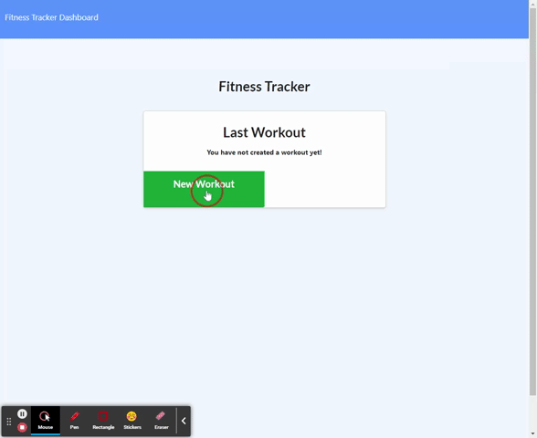

# NoSQL Workout Tracker

**This project is a fullstack browser application that utlizies Node.Js, MongoDB, Mongoose, and Express to create a fitness workout logger that takes in new/existing excerises. It utilizes MongoDB with Mongoose to log your workouts to the database which can be analyzed in the app's dashboard.**

## Built With

* [Javascript](https://www.javascript.com/)
* [Node.Js](https://nodejs.org/en/)
* [Express.Js](https://expressjs.com/)
* [MongoDB](https://www.mongodb.com/)
* [Mongoose](https://mongoosejs.com/docs/)
* [Morgan](https://www.npmjs.com/package/morgan)

## Instructions
Steps to install application:

1. Clone repository.
2. Run npm install
3. Run npm run seed in command line to seed the database.
4. Run NPM Start to turn on your server
5. Server will be running locally on your machine
6. Alternative is to just visit the Heroku Deployed link to see the application.

* [Heroku Deployed](https://obscure-eyrie-11833.herokuapp.com/)

## Author

* **DEREK BANISTER** 

- [Link to Portfolio Site](https://derek-banister-portfolio.herokuapp.com/)
- [Link to Github](https://github.com/DerekBanister)
- [Link to LinkedIn](https://www.linkedin.com/in/derek-banister/)